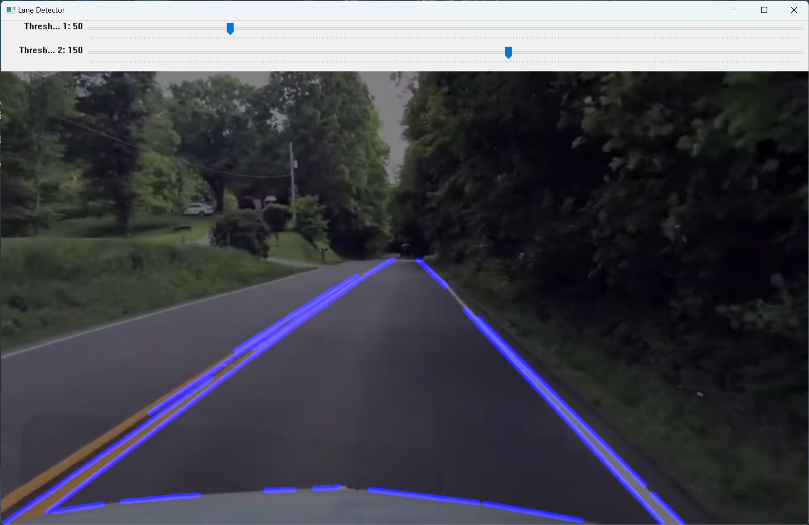

# Road Lane Detection

This repository contains a Python script for detecting and displaying lanes in a video using OpenCV.



## Requirements
- Python 3.x
- OpenCV (`cv2`) library
- NumPy library
- Docker Desktop 

## Usage
1. Clone the repository or download the `lane_detection.py` script.
2. Make sure you have Python 3.x installed on your system along with the required libraries.
3. Place the video file you want to analyze in the same directory as the script. In case your video is titled differently, ensure that you change it to `test.mp4`.
4. Run the script using the following command:
```shell
   python main.py
```
5. To run a container, refer to the ***Dockerfile Guide***.

## Main Code
The main code initializes the video capture object using the provided video file path. It creates a named window "Lane Detector" and adds two trackbars for adjusting the Canny edge detection thresholds. The script then proceeds to process each frame of the video:

1. It reads a frame from the video.
2. Applies Canny edge detection to the frame using the `canny` function.
3. Masks the region of interest in the frame using the `roi` function.
4. Detects lines in the masked frame using the Hough Line Transform (`cv.HoughLinesP`).
5. Draws the detected lines on a new image using the `displayLines` function.
6. Combines the original color frame and the lines image using `cv.addWeighted`.
7. Displays the resulting frame in the "Lane Detector" window.
8. The script continues processing frames until the user presses the 'q' key, at which point it terminates the video capture and closes the window.

Feel free to modify the threshold values and the region of interest (`roi_vertices`) to better suit your specific use case. Happy lane detection!

# Dockerfile Guide

## Prerequisites
Before building the Docker image, install the basic framework for a GUI environment, specifically 'X11' (assuming users are using Ubuntu).
```bash
apt-get install x11-xserver-utils
```


To display a GUI-based application in Docker, Allow X server connection:
```bash
xhost +local:*
```
You will get message "non-network local connections being added to access control list".
## Verify Docker Status
To ensure a seamless Docker experience, it's essential to check the status of the Docker service on your system.To verify whether the Docker service is currently active or inactive, you can use the following steps:
1. Check Docker Service Status:
```bash
systemctl status docker
```
if it's inactive, you'll need to take corrective action.

2. To activate the Docker service, use the following command:
```bash
sudo systemctl start docker
```
Re-run the **step-1** to verify the Changes.
## Build
Now, let's build the Docker image named 'lane_detection_app' using the docker build command:
```bash
sudo docker build -t lane_detection_app .
```
## Run
Write the following command to run a Docker container named 'lane_detection'
```bash
sudo docker run -e DISPLAY=$DISPLAY -v /tmp/.X11-unix/:/tmp/.X11-unix/ --name lane_detection lane_detection_app
```
:tada: Yeah,You will be able to see the video playing on the display.
## Closing Notes
After the completion of testing,make sure to disallow the X server connection:
```bash
xhost -local:*
```
You will get message "non-network local connections being removed from access control list".

